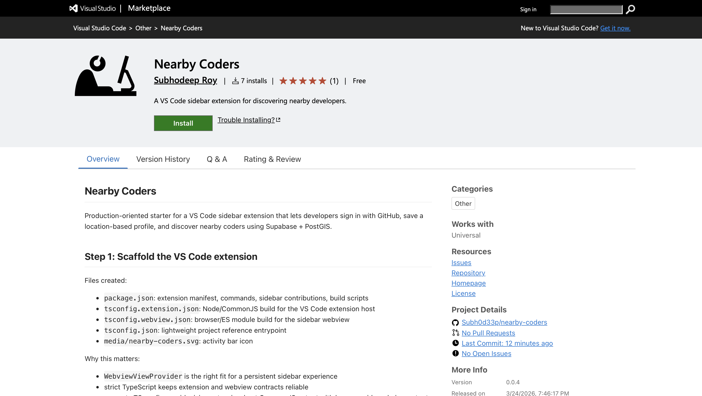
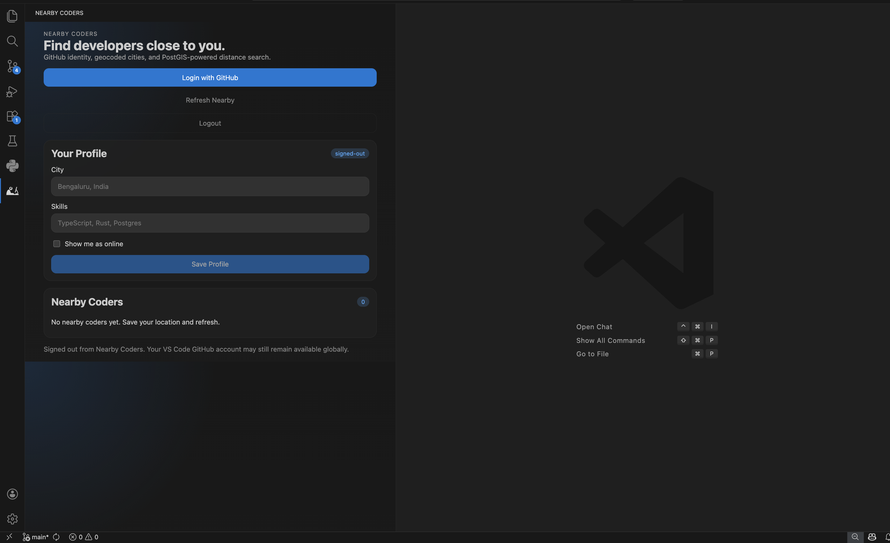
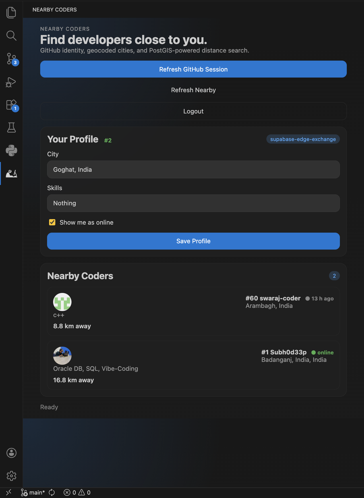
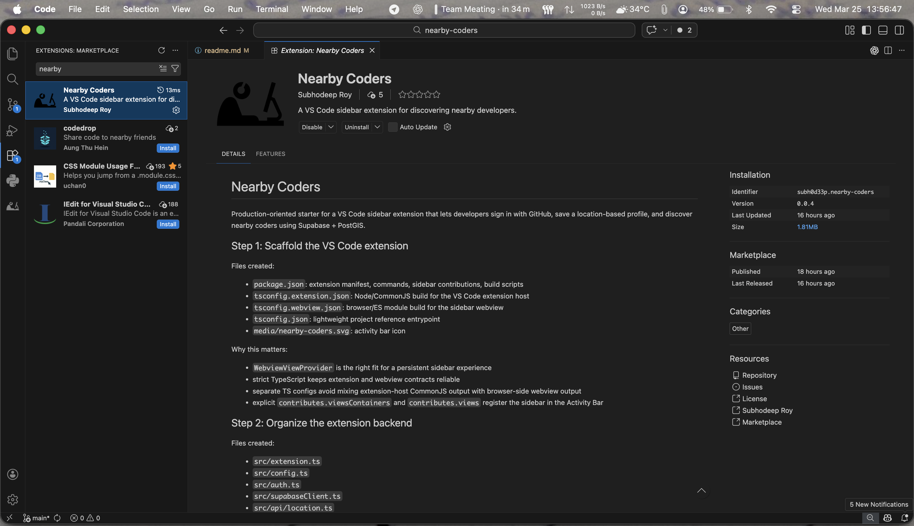

# Nearby Coders VS Code Extension


A VS Code sidebar extension to discover nearby developers using GitHub identity, Supabase, and PostGIS distance search.

Find coders near you, share your location, and connect with developers in your area directly from VS Code.

---

## 🚀 Marketplace

Install from Visual Studio Marketplace:

https://marketplace.visualstudio.com/items?itemName=Subh0d33p.nearby-coders



---

## ✨ Features

- GitHub login inside VS Code
- Save developer profile
- Location-based search
- Nearby coders list
- Distance calculation (PostGIS)
- Online status
- Supabase backend
- Sidebar UI in VS Code

---

## 🖼 Screenshots

### Login / Profile



### Nearby coders list



### Extension inside VS Code



### Marketplace page


---

## 🧠 How it works

Architecture:

VS Code Extension → GitHub Auth → Supabase → Postgres + PostGIS → Nearby search → Webview UI

- VS Code API for sidebar
- Supabase for backend
- PostGIS for distance query
- Webview for UI
- TypeScript extension host

---

## 📦 Installation

From Marketplace:

https://marketplace.visualstudio.com/items?itemName=Subh0d33p.nearby-coders

Or search in VS Code:

```
Nearby Coders
```

---

## ⚙️ Usage

1. Open Nearby Coders sidebar
2. Login with GitHub
3. Enter city and skills
4. Save profile
5. Refresh nearby
6. See developers near you

---

## 🛣 Roadmap

Planned features:

- Auto location detection
- Map view
- Follow / connect system
- Chat between coders
- Public API
- Web dashboard
- Mobile app
- Leaderboard / streak
- Real-time online status

---

## 🧑‍💻 Tech Stack

- TypeScript
- VS Code Extension API
- Supabase
- PostgreSQL
- PostGIS
- Webview UI
- GitHub Auth

---

## 📂 Repository

https://github.com/Subh0d33p/nearby-coders

---

## 🤝 Contributing

Contributions are welcome.

1. Fork repo
2. Create branch
3. Make changes
4. Open PR

---

## 📜 License

MIT License